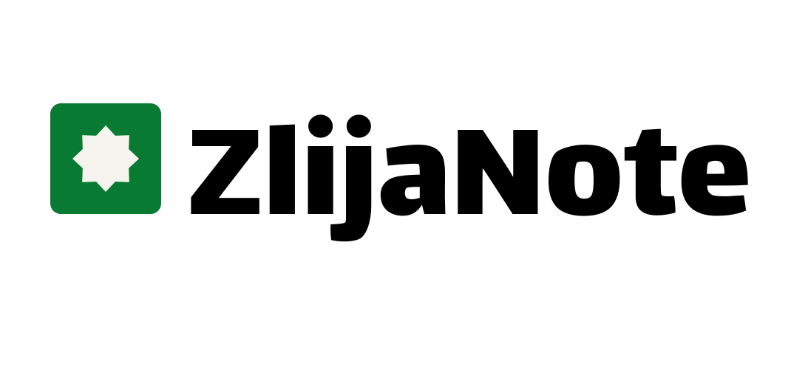

# ZlijaNote



> ZlijaNote is a local-first visual note editor for developers. Create beautiful HTML/CSS notes with drag-and-drop or write the code yourself.

ZlijaNote turns every note into a real, portable `.html` file: your note is a genuine HTML document with its own `<style>` in the `<head>`, openable in any browser, never locked into a proprietary format. What you make is what you see — freedom of code with the ease of visual building.

**Status:** v0.1.0-alpha in active development. Not production-ready yet.

## Philosophy

- **Local-first** — no account, no telemetry, everything stored in plain files on your machine.
- **Real HTML** — notes are complete HTML documents (not a subset), with per-note CSS and metadata in `<head>`.
- **No lock-in** — the `.html` file is the source of truth; the editor is just a tool.
- **User freedom** — the app never silently rewrites or "fixes" your code.
- **Always open source** — MIT OR Apache-2.0.

## Features (v0.1.0-alpha scope)

- Project management inside a user-chosen Workspace
- Notes as standalone `.html` files with embedded per-note CSS
- Visual editor (GrapesJS) with drag-and-drop components: headings, cards, callouts, code blocks, checklists, images, tables, and more
- HTML and CSS code modes with a supported-tags whitelist and clear errors (user code is never deleted)
- Sandboxed preview — no JavaScript execution in v0.1
- Local assets folder shared per project
- Search by title, tags, pinned notes, recent notes
- Trash with restore, manual ZIP backup, basic version history (last 30 versions per note)
- Eye-friendly light/dark theme inspired by Moroccan zellige colors
- English UI; note content supports all languages (RTL included)
- Linux desktop app, distributed as AppImage (Arch Linux first)

### Explicitly out of scope for v0.1

JavaScript in notes, encryption, cloud sync (OneDrive/Google Drive), real-time collaboration, video/audio elements, mobile support, Windows/macOS releases, plugins marketplace, AI writing, full-content search, custom editor engine (ZlijaNote Core comes after product maturity).

## Workspace layout

```
Workspace/
└── project-zlijanote/
    ├── project.zlija.json   # name, banner, created date, tags, pinned notes, settings
    ├── notes/
    │   ├── architecture.html
    │   ├── rust-roadmap.html
    │   └── ui-ideas.html
    ├── assets/              # images and files shared across the project
    ├── history/             # previous versions of each note
    └── trash/               # deleted notes, recoverable
```

Each note is a real HTML document:

```
HTML document
├── head
│   ├── ZlijaNote metadata
│   ├── title
│   ├── created date
│   ├── updated date
│   ├── tags
│   └── style
└── body
    └── user content, fully designable
```

## Editor modes

- **Design Mode** — visual editing with official ZlijaNote components only
- **HTML Mode** — code editing restricted to the supported-tags whitelist
- **CSS Mode** — free CSS, saved exactly as written
- **Preview Mode** — sandboxed rendering of the final result

## Tech stack

- **Rust + Tauri** — desktop shell, file system, and workspace management
- **GrapesJS** — visual editor for the first release (files stay the source of truth; a custom ZlijaNote Core engine is planned for later)
- **Plain HTML/CSS files** — the storage format

## Development

Prerequisites: Rust (stable), Cargo.

```bash
git clone <repo-url> && cd ZlijaNote
cargo run
```

Project documentation lives in [`doc/`](doc/):

- `doc/product-spec.md` — product specification for v0.1.0-alpha
- `doc/file-format.md` — `project.zlija.json` and HTML metadata format
- `doc/architecture.md` — Rust/Tauri, editor UI, and file layer architecture
- `doc/security.md` — sandbox and iframe policies
- `doc/ui-flow.md` — main screens and navigation
- `doc/decisions/` — RFCs for significant design decisions

## UI/UX

[ZlijaNote UI/UX in Figma](https://www.figma.com/design/qI93IlWSswc4UgW0DcNwVF/Untitled?node-id=0-1&t=Q3vini1qLztxZcgI-1)

## Contributing

See [CONTRIBUTING.md](CONTRIBUTING.md). Design decisions follow an RFC process documented in `doc/decisions/0000-template.md`.

## License

Licensed under either of:

- Apache License, Version 2.0 ([LICENSE-APACHE](LICENSE-APACHE))
- MIT license ([LICENSE-MIT](LICENSE-MIT))

at your option.

## Trademark

Zlija™, the Zlija logo, the Zlija name, Zlija.app™, the Zlija.app logo, the Zlija.app name, ZlijaNote™, the ZlijaNote logo, and the ZlijaNote name are trademarks of Yassine Azmi.
See [TRADEMARKS.md](./TRADEMARKS.md) for permitted use.
